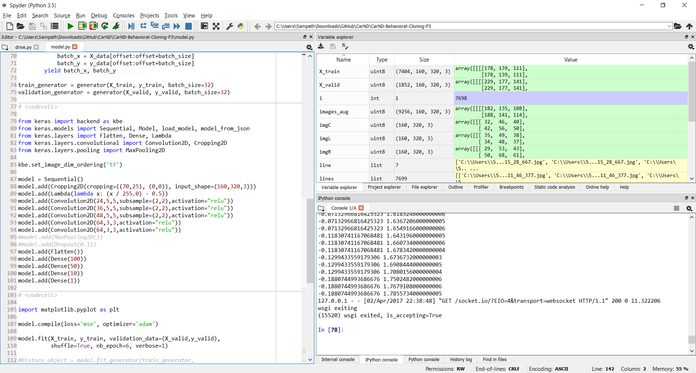

## Overview

In this submission for ***Behavioral Cloning Project*** the following topics have been covered. Key steps corresponding to each stage of the project execution have been summarized. Where applicable, images or animations are presented to guide the reviewer.

[TOC]

## Development Environment Setup

The project was executed using *Spyder* development suite as a part of the *Anaconda* python environment rather than an IPython notebook as it has features such as variable inspector, set breakpoints, use block mode execution. A quick snapshot of the development environment during project development is shown below. If the reviewer does not have access to the *Spyder* IDE, relevant cells of the script can be commented during execution.



## Behavioral Cloning Methodology

The methodology adopted for *Behavioral Cloning Project* is as follows. Each of these steps is described in greater detail in the following sections.
1. [Strategy for collecting training data using the simulator on Track 1](#1.-data-collection)
2. [Data augmentation techniques](#1.2.-training-data-filtering,-augmentation-and-splitting)
3. [Build NVIDIA CNN in Keras to predict steering angle based on input image](#2.1.-model-architecture)
4. [Train NVIDIA CNN network using split training and validation data](#2.3.-model-training)
5. [Tested the model successfully to drive around Track 1](#3.-using-trained-model-to-drive-in-autonomous-mode)
6. [Extended training data from Track 2 and strategy to combine data with Track 1](#4.-extending-to-track-2)
7. [Challenges in generalizing the model for both Track 1 and Track 2](#4.-extending-to-track-2)


### 1. Data Collection

Training data was collected using centerline driving on track 1 for two laps in both forward and reverse directions. An additional lap was completed where recovery maneuvers were performed at random locations in the track. This was done in order for network to train how to corrective action if the car starts to veer of the track. The image and the steering angle were reviewed using an automated script.

#### 1.1. Influence of controller

In order to understand the influence of controller choice, three training data collection sessions were run. Three controller options available in the simulator were tested - (i) keyboard arrows (ii) mouse drag and (iii) Xbox 360 gamepad. This is crucial information as the driver behavior cloned into the model will include the controller behavior. In the following histogram chart, a summary of the steering angles recorded for two forwards laps of track 1 using the three controller are shown.


Note that the above histogram, the bin counts are shown using a logarithmic scale. It can be seen that the the keyboard method has a large skew in the steering angles. More precisely, the steering angles are saturated at $$0.0$$ and at around $$\pm 0.5$$ as shown using red encircled regions. This is expected from the keyboard steering method, as the input from the user can only be done in discreet bursts. In contrast, the mouse and xbox360 controller input methods are more spread-out in the histogram as low/intermediate steering input can be sustained for a longer duration. This is representative of how a human would typically drive a car. Based on this assessment, the remainder of data collection was done using an Xbox360 gamepad controller. In total, for track 1, about 7500 image and steering input points were collected for training purpose.

####1.2. Training data filtering, augmentation and splitting

The image and steering input data were read from the database created during the training session in the simulator. The following data filtering and augmentation steps were used.
* Images with corresponding steering input less than 1% (0.01) were ignored. This was to remove bias in the trained model for driving straight.
* Center camera image was flipped and corresponding steering angle negated.
* Images from left and right cameras were include with a steering correction factor of 0.1. This was assigned after trial with 0.2 correction as indicated in the course lectures. However, 0.2 steering corrected resulted in the car weaving along the center line when driven in autonomous mode using the trained model.
* Upon filtering and augmenting the final training set size was around 9,200 images.
* The augmented data was shuffled and split into training and validation datasets with 80% and 20% split.

####1.3. Optional training generator
A training generator was defined to batch the data. However, it was found that the training data could be sent to the GPU in a single step. Hence, to speed-up the training process, the training generator function was ***not*** used.
```python
def generator(X_data, y_data, batch_size=32):
    num_samples = len(X_data)
    while 1: # Loop forever so the generator never terminates
        shuffle(X_data, y_data)
        for offset in range(0, num_samples, batch_size):
            batch_x = X_data[offset:offset+batch_size]
            batch_y = y_data[offset:offset+batch_size]
        yield batch_x, batch_y

train_generator = generator(X_train, y_train, batch_size=32)
validation_generator = generator(X_valid, y_valid, batch_size=32)
```

The training generator can be called on training data using the following lines of code.

```python
history_object = model.fit_generator(train_generator,
                                     samples_per_epoch=len(X_train),
                                     validation_data=validation_generator,
                                     nb_val_samples=len(X_valid),
                                     nb_epoch=5,
                                     verbose=1)
```

###2. Model definition and usage

The NVIDIA CNN model architecture was implement for this project. The implementation of the model and the training pipeline can be seen in lines 79-101 in model.py file. The NVIDIA CNN model has been very successful in the NVIDIA self-driving car implementation.

#### 2.1. Model architecture

An overview of the model is shown below.


The NVIDIA training pipeline contains 5 convolutional layers and 3 fully-connected layers. The input image is cropped to remove 70 and 25 pixels from top and bottom portion of the image, respectively. This aggressive cropping of sky/trees and car hood was found to have beneficial influence on reliability of mapping image to steering angle. Further, the input image is normalized using the `Lambda` function. The following lines show how the training pipeline was implemented using Keras.

```python
model = Sequential()
model.add(Cropping2D(cropping=((70,25), (0,0)), input_shape=(160,320,3)))
model.add(Lambda(lambda x: (x / 255.0) - 0.5))
model.add(Convolution2D(24,5,5,subsample=(2,2),activation="relu"))
model.add(Convolution2D(36,5,5,subsample=(2,2),activation="relu"))
model.add(Convolution2D(48,5,5,subsample=(2,2),activation="relu"))
model.add(Convolution2D(64,3,3,activation="relu"))
model.add(Convolution2D(64,3,3,activation="relu"))
model.add(Flatten())
model.add(Dense(100))
model.add(Dense(50))
model.add(Dense(10))
model.add(Dense(1))	
```

As seen above, the convolutional layers use 5x5 and 3x3 filter sizes and include a ReLU layer to introduce non-linearity. After the fifth convolutional layer, the layer is flattened and then passed to the three fully-connected layers. The Keras model summary is shown below for completeness.

```
____________________________________________________________________________________________________
Layer (type)                     Output Shape          Param #     Connected to                     
====================================================================================================
cropping2d_1 (Cropping2D)        (None, 65, 320, 3)    0           cropping2d_input_1[0][0]         
____________________________________________________________________________________________________
lambda_1 (Lambda)                (None, 65, 320, 3)    0           cropping2d_1[0][0]               
____________________________________________________________________________________________________
convolution2d_1 (Convolution2D)  (None, 31, 158, 24)   1824        lambda_1[0][0]                   
____________________________________________________________________________________________________
convolution2d_2 (Convolution2D)  (None, 14, 77, 36)    21636       convolution2d_1[0][0]            
____________________________________________________________________________________________________
convolution2d_3 (Convolution2D)  (None, 5, 37, 48)     43248       convolution2d_2[0][0]            
____________________________________________________________________________________________________
convolution2d_4 (Convolution2D)  (None, 3, 35, 64)     27712       convolution2d_3[0][0]            
____________________________________________________________________________________________________
convolution2d_5 (Convolution2D)  (None, 1, 33, 64)     36928       convolution2d_4[0][0]            
____________________________________________________________________________________________________
flatten_1 (Flatten)              (None, 2112)          0           convolution2d_5[0][0]            
____________________________________________________________________________________________________
dense_1 (Dense)                  (None, 100)           211300      flatten_1[0][0]                  
____________________________________________________________________________________________________
dense_2 (Dense)                  (None, 50)            5050        dense_1[0][0]                    
____________________________________________________________________________________________________
dense_3 (Dense)                  (None, 10)            510         dense_2[0][0]                    
____________________________________________________________________________________________________
dense_4 (Dense)                  (None, 1)             11          dense_3[0][0]                    
====================================================================================================
Total params: 348,219
Trainable params: 348,219
Non-trainable params: 0
____________________________________________________________________________________________________
```

####2.2. Optimization setup

The model is compiled use the `mse` loss function and `adam` optimizer. Further, the fitting is carried out over 6 training epochs using the previously split training and validation data. The training pipeline is executed over 6 epochs in about 10 minutes on the laptop. Learning rate was not tuned as `adam` optimizer was used.

```python
model.compile(loss='mse', optimizer='adam')
model.fit(X_train, y_train, validation_data=(X_valid,y_valid),
          shuffle=True, nb_epoch=6, verbose=1)
```

#### 2.3. Model training

The history of training and validation loss is shown in the following graph. It can be seen that the overall loss for training and validation set is low (<0.1). Furthermore, both training and validation losses reduce after each epoch. This is a sign that the model is not overfitting and is generalizing the representation of the training data well.


####2.4. Model usage

The model is saved to disk for reuse. The HDF file saved to the disk contains both the network definition as well as the associated weights. The model HDF file can be loaded from disk and used during the autonomous driving sessions.

```python
# Save model to disk
model.save('model_track1.h5')
print("Saved model to disk")

# Load model network and weights
model = load_model('model_track1.h5')
print("Loaded model from disk")

# Use HDF file in simulator for autonomous mode (record session if needed)
runfile('drive.py', args='model_track1.h5')
#runfile('drive.py', args='model_track1.h5 video_track1')
```

###3. Using trained model to drive in autonomous mode

The trained model is used to drive the car on track 1 in autonomous mode. The following animated GIF file shows the screencast of the autonomous driving session around track 1. Optionally, the [video for track 1](.\writeup_media\video_track1.mp4) from the `drive.py` script is also recorded.


### 4. Extending to Track 2

The trained model from track 1 was could not be used as-is for track 2 as the model had difficulty in negotiating sharp turns and bends in quick successions. This is primarily due to the fundamental differences between the two tracks. Analysis of the two tracks using the steering data revels that track 1 is heavily biased towards straight-line driving, whereas track 2 is heavily biased towards end-to-end steeping input. The following graphs shows this distinction. Note in track 1, there is five time more training data at $$0.0$$ input than track 2. Also, there is significantly more input in track 2 in the region of $$\pm 0.5-1.0$$ steering input.


In order to generalize, the 20% training data from track 1 and 80% data from track 2 was used to train the model once again. The starting weights were used from original track 1 trained model. This trained model worked very well, and is able to complete multiple laps of track 2. The following animated GIF file shows the screencast of the trained model driving track 2 in autonomous mode. Optionally, the [video for track 2](.\writeup_media\video_track2.mp4) from the `drive.py` script is also recorded.


## Concluding Remarks

The *Behavioral Cloning Project* has been completed successfully. The NVIDIA CNN architecture was used clone the driver behavior and the model was trained using data from track 1. The training, filtering, augmenting and fitting strategies were effective as the model was able to complete multiple laps of track 1. This model, however, could not generalize to track 2 due to inherent differences in the composition of turns/bends. The trained model from track 1 was further augmented using data from track 2. This model was able to successfully complete multiple laps of track 2 in autonomous mode.

Overall, this project was a great learning experience. In the process of completing this project, the importance of proper data collection strategy is clearly understood. The filtering and augmentation steps are also crucial in ensuring that the trained network does not get biased to certain specific features of training set. The project clearly demonstrated the importance of understand the data - and that applied deep learning is indeed ***an art*** and ***not an exact science***.

